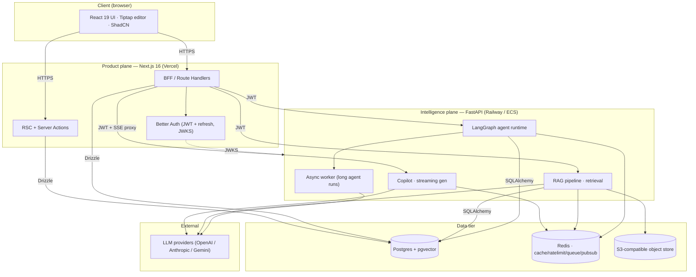
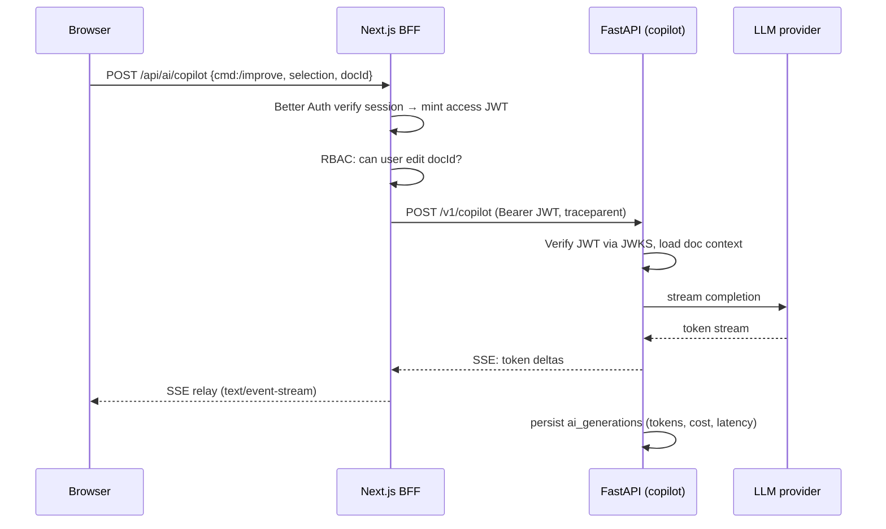
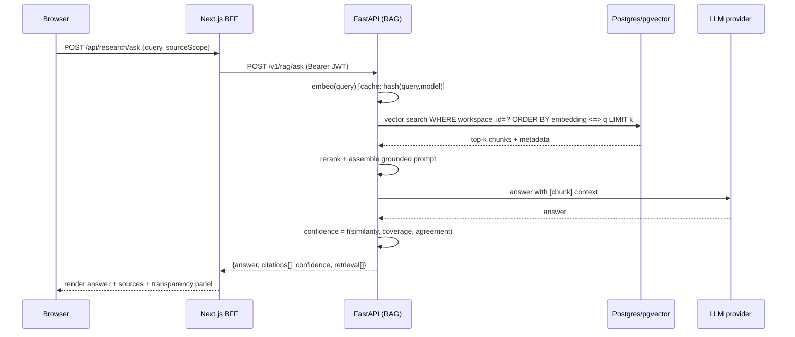
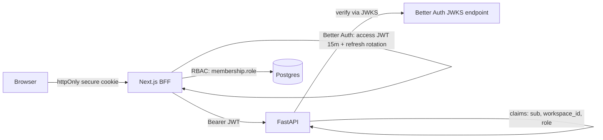

# VAYU AI — High-Level Design

Companion to `01-overview.md`. This covers the component decomposition, the critical
request flows, and the scaling / caching / security architectures.

---

## 1. Component diagram

---

## 2. Critical request flows

### 2.1 Inline AI copilot (streaming)

The BFF is a **thin authenticated proxy** for streaming: it owns identity & RBAC, the AI
plane owns generation. The browser never holds a provider key or a service URL.

### 2.2 RAG query (grounded answer with citations)

### 2.3 Document ingestion (upload → searchable)

`Upload → S3` → enqueue Redis job → worker: `parse → chunk → embed (batched) → upsert
embeddings (pgvector)` → mark `knowledge_sources.status = ready`. The HTTP request returns
immediately with a `processing` source; the UI subscribes to status via polling or Redis
pub/sub. Long work never blocks a request.

### 2.4 Agent run (LangGraph, async + checkpointed)

`BFF → POST /v1/agents/{type}/run` returns a `run_id` fast. LangGraph executes a state
machine (plan → tool calls → synthesize), **checkpointing each step** to `agent_runs` /
`agent_steps`. Progress streams over SSE; a crashed worker resumes from the last checkpoint.
Human-in-the-loop steps pause the graph until the user approves.

---

## 3. Scaling strategy

| Tier | Scale unit | Signal | Notes |
|---|---|---|---|
| Product plane | Stateless Next.js instances / edge | RPS, CPU | Sessions in cookies+Redis, not memory |
| Intelligence plane | Stateless FastAPI replicas | inflight requests, queue depth | No sticky state; JWT-authenticated |
| Agent workers | Worker pool consuming Redis queue | queue depth | Long runs decoupled from HTTP |
| Postgres | Vertical first, then read replicas | conns, IOPS | PgBouncer pooling; replicas for analytics/RAG reads |
| pgvector | HNSW index; partition by workspace at scale | recall/latency | Start single table; partition when hot |
| Redis | Single → cluster | memory, ops/s | Namespaced keys per concern |

**Principle:** keep both planes stateless so scaling is "add replicas." All durable state
lives in Postgres / Redis / S3.

---

## 4. Caching strategy

| Layer | What | Key | TTL / invalidation |
|---|---|---|---|
| CDN / edge | Static assets, RSC payloads | route + cache tags | tag-based revalidation on write |
| Redis — query embeddings | `embed(query)` vectors | `emb:{model}:{sha1(query)}` | 24h |
| Redis — RAG retrieval | top-k for a (query, scope) | `rag:{workspace}:{sha1(query+scope)}` | 10 min |
| Redis — AI idempotency | dedupe identical generations | `gen:{sha1(prompt+params)}` | 1h |
| Redis — rate limits | token-bucket counters | `rl:{userId}:{route}` | sliding window |
| Redis — session/RBAC | hot membership lookups | `mem:{userId}:{workspace}` | 5 min, busted on role change |
| Postgres | materialized analytics rollups | — | scheduled refresh |

Write-through on document edits busts the relevant RAG/embedding caches scoped to that
document so research answers never go stale silently.

---

## 5. Security architecture

- **AuthN:** Better Auth — access JWT (short-lived) + rotating refresh token in httpOnly,
  `SameSite=Lax`, `Secure` cookie. JWTs signed with rotating keys exposed via JWKS.
- **AuthZ:** RBAC keyed on `memberships(workspace_id, user_id, role ∈ {owner,admin,editor,
  viewer})`. Enforced in the BFF on every mutation **and** re-checked in the AI plane from
  JWT claims — defense in depth.
- **Tenant isolation:** every domain row carries `workspace_id`; queries are workspace-scoped;
  Postgres RLS policies are ready to switch on for hard isolation.
- **Input safety:** rich text sanitized (server-side, allowlist) before persistence; all
  inputs validated (zod in TS, Pydantic in Py); SQL only through parameterized ORM queries.
- **Transport/headers:** strict CSP, HSTS, `X-Content-Type-Options`, `Referrer-Policy`.
- **Abuse:** Redis token-bucket rate limits per user+route; AI spend caps per workspace.
- **Audit:** `audit_logs` records actor, action, target, ip, metadata for sensitive ops.
- **Secrets:** env-injected (SSM/Vault in prod); provider keys live only in the AI plane.

---

## 6. Observability architecture

- **Tracing:** OpenTelemetry SDK in both planes; BFF injects W3C `traceparent`, FastAPI
  continues the trace — one span tree spans browser→BFF→AI→LLM.
- **Logs:** structured JSON (pino in TS, structlog in Py) with `trace_id`, `user_id`,
  `workspace_id`, `request_id` on every line.
- **Errors:** Sentry in both runtimes, releases tied to git SHA.
- **AI-specific metrics:** tokens in/out, $ cost per generation, model latency, retrieval
  hit-rate, agent step durations, queue depth — exported via OTel metrics.

See `04-api.md` for the concrete endpoints and the streaming contract.
