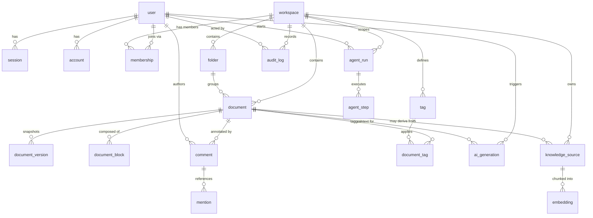

# VAYU AI — Data Model

One Postgres cluster, two owners. The **product plane** (Drizzle migrations) owns identity,
workspaces, documents, and collaboration. The **intelligence plane** (Alembic migrations)
owns knowledge sources, embeddings, and agent runs. Cross-plane references are **UUIDs, not
foreign keys**, so the boundary can become a service split later with no schema rewrite.

---

## 1. ER diagram

> `knowledge_source.document_id`, `embedding.workspace_id`, `agent_run.workspace_id` etc.
> are **logical** references across the plane boundary (UUID columns, indexed, not FK-enforced).

---

## 2. Product-plane tables (Drizzle → `packages/db`)

Auth tables follow Better Auth's schema so its adapter works out of the box.

### `user` — identity
`id` (uuid pk) · `name` · `email` (unique) · `email_verified` (bool) · `image` ·
`created_at` · `updated_at`

### `session` — active sessions
`id` (uuid pk) · `user_id` (fk→user) · `token` (unique) · `expires_at` · `ip_address` ·
`user_agent` · `active_workspace_id` (uuid) · `created_at` · `updated_at`

### `account` — credential / OAuth links (Better Auth)
`id` · `user_id` (fk) · `provider_id` · `account_id` · `password` (hash, for email/pw) ·
`access_token` · `refresh_token` · `id_token` · `*_expires_at` · `scope` · timestamps

### `verification` — email / token verification (Better Auth)
`id` · `identifier` · `value` · `expires_at` · timestamps

### `workspace` — tenant boundary
`id` (uuid pk) · `name` · `slug` (unique) · `owner_id` (fk→user) · `plan` · `settings` (jsonb)
· `created_at` · `updated_at`

### `membership` — user ↔ workspace + role (RBAC core)
`id` · `workspace_id` (fk) · `user_id` (fk) · `role` (enum: owner|admin|editor|viewer) ·
`invited_by` · `created_at` · **unique(workspace_id, user_id)**

### `folder` — document tree
`id` · `workspace_id` (fk) · `parent_id` (self-fk, nullable) · `name` · `position` ·
timestamps

### `document` — the core editable unit
`id` (uuid pk) · `workspace_id` (fk) · `folder_id` (fk, nullable) · `title` ·
`icon` · `cover_image` · `content` (jsonb — Tiptap/ProseMirror doc) · `content_text` (tsvector
source for full-text) · `created_by` (fk→user) · `is_archived` · `is_template` ·
`current_version` (int) · `created_at` · `updated_at`

### `document_version` — Git-for-docs (immutable snapshots)
`id` · `document_id` (fk) · `version` (int) · `content` (jsonb snapshot) · `summary` ·
`diff` (jsonb, vs previous) · `created_by` (fk) · `created_at` · **unique(document_id, version)**

### `document_block` — optional normalized block index
`id` · `document_id` (fk) · `block_id` (stable client id) · `type` · `text` · `position` ·
`parent_block_id` (self-fk) — used for block-level comments, backlinks, and block search.

### `comment` — threaded annotations
`id` · `document_id` (fk) · `block_id` (nullable) · `parent_id` (self-fk, threads) ·
`author_id` (fk) · `body` · `resolved` (bool) · `created_at` · `updated_at`

### `mention` — @user / @doc references inside comments or docs
`id` · `comment_id` (fk, nullable) · `document_id` (fk, nullable) · `mentioned_user_id` (fk) ·
`created_at`

### `tag` + `document_tag`
`tag`: `id` · `workspace_id` (fk) · `name` · `color` · **unique(workspace_id, name)**.
`document_tag`: `document_id` (fk) · `tag_id` (fk) · **pk(document_id, tag_id)**.

### `ai_generation` — copilot usage ledger
`id` · `workspace_id` · `user_id` (fk) · `document_id` (nullable) · `command` (/improve…) ·
`provider` · `model` · `prompt_tokens` · `completion_tokens` · `cost_usd` · `latency_ms` ·
`status` · `created_at` — powers analytics + spend caps.

### `audit_log` — security trail
`id` · `workspace_id` · `actor_id` (fk→user) · `action` · `target_type` · `target_id` ·
`ip_address` · `metadata` (jsonb) · `created_at`

---

## 3. Intelligence-plane tables (Alembic → `apps/ai`)

### `knowledge_source` — an ingested document/file
`id` (uuid pk) · `workspace_id` (uuid, logical ref) · `document_id` (uuid, nullable) ·
`title` · `source_type` (pdf|docx|txt|md|url) · `storage_key` (S3) · `status`
(processing|ready|failed) · `error` · `chunk_count` · `token_count` · `metadata` (jsonb) ·
`created_by` (uuid) · `created_at` · `updated_at`

### `embedding` — vector chunks (pgvector)
`id` (uuid pk) · `knowledge_source_id` (fk) · `workspace_id` (uuid, **indexed for tenant
scoping**) · `document_id` (uuid, nullable) · `chunk_index` (int) · `content` (text) ·
`token_count` (int) · `embedding` (**vector(1536)**) · `metadata` (jsonb) · `created_at`

Indexes: `HNSW (embedding vector_cosine_ops)` for ANN search; btree on `workspace_id` so the
ANN scan is pre-filtered to a tenant. Dimension is config-driven (1536 = `text-embedding-3-small`).

### `agent_run` — one invocation of an agent
`id` (uuid pk) · `workspace_id` (uuid) · `user_id` (uuid) · `agent_type`
(research|writing|seo|docs|proofread|interview|resume) · `input` (jsonb) · `status`
(queued|running|paused|succeeded|failed) · `output` (jsonb) · `checkpoint` (jsonb — LangGraph
state) · `total_tokens` · `cost_usd` · `started_at` · `finished_at` · `created_at`

### `agent_step` — per-node execution trace
`id` · `agent_run_id` (fk) · `step_index` · `node` (graph node name) · `type`
(llm|tool|router|human) · `input` (jsonb) · `output` (jsonb) · `tokens` · `latency_ms` ·
`created_at` — this is what powers the agent transparency timeline in the UI.

---

## 4. Why these choices

- **`content` as JSONB, not HTML.** Tiptap/ProseMirror is a JSON document model. Storing the
  canonical JSON keeps the editor lossless and lets us derive HTML/text/markdown on demand.
  `content_text` is maintained for Postgres full-text; semantic search lives in `embedding`.
- **Versions are immutable snapshots, not diffs-only.** Snapshot + stored diff = O(1) restore
  and cheap timeline rendering, at the cost of storage (acceptable; JSONB compresses well).
- **Blocks are an optional projection.** The source of truth is `document.content`; the block
  table is a denormalized index for block-level comments, backlinks, and granular search.
- **UUIDs everywhere** so IDs are mintable client-side, safe to expose, and stable across the
  plane boundary.
- **`workspace_id` on every tenant row** — the precondition for RLS and for partitioning the
  embedding table by tenant when it gets hot.
